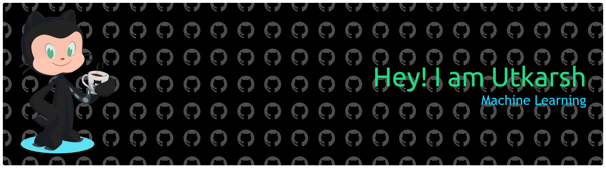

  

# 💫 About Me:

CSE undergraduate focused on AI and Machine Learning.   Building end-to-end projects in data processing and ML systems.   Interested in clean code, strong fundamentals, and scalable solutions. Open to internships and collaborative projects

## 🌐 Socials:
   

# 💻 Tech Stack:

  

# 📊 GitHub Stats:
 
 

##  Blog posts
<!-- BLOG-POST-LIST:START -->
<!-- BLOG-POST-LIST:END -->
**https://medium.com/@utkarshsri07/the-rise-of-efficient-ai-e2d5347f4b76**

**https://medium.com/@utkarshsri07/demystifying-principal-component-analysis-pca-a-step-by-step-mathematical-formulation-3ae5bbd5b7ef**

<!-- Proudly created with GPRM ( https://gprm.itsvg.in ) -->
